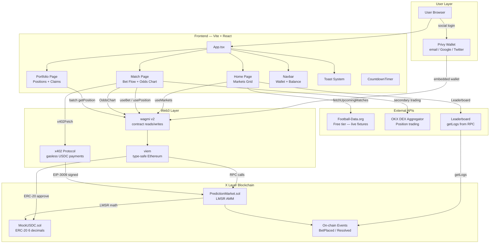
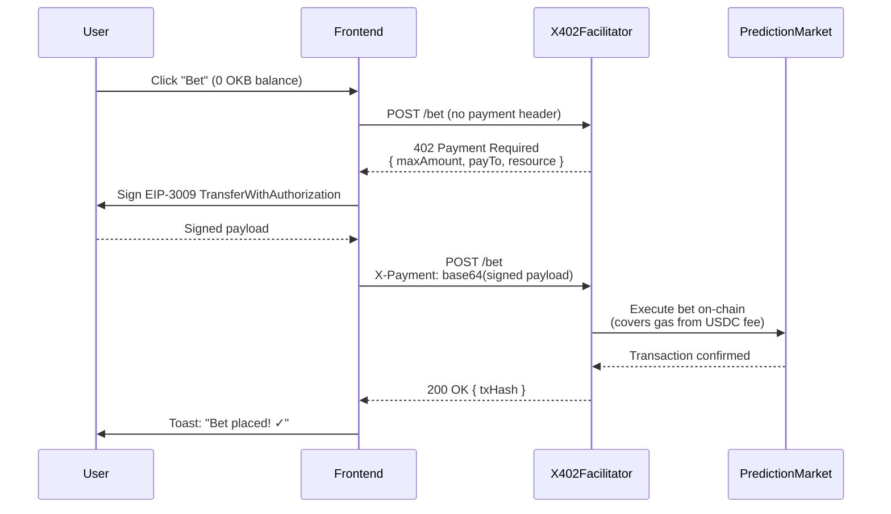

# ⚽ GoalMarket — LMSR Football Prediction Markets on X Layer

> Real-time, gasless prediction markets for football matches. Bet with USDC using social login (no seed phrases). Powered by LMSR automated market making, x402 payment protocol, and live Football-Data.org match data.

---

## Live Deployment

| Resource | URL |
|----------|-----|
| **Frontend** | `https://goalmarket.vercel.app` *(deploy yours — see below)* |
| **Contract (Testnet)** | `0x<FILL_AFTER_DEPLOY>` on X Layer Testnet (chainId 195) |
| **MockUSDC (Testnet)** | `0x<FILL_AFTER_DEPLOY>` on X Layer Testnet |
| **OKLink Explorer** | https://www.oklink.com/xlayer-test |

> **After deploying**, fill in the addresses above from `deployments.json`.

---

## Architecture



---

## x402 Payment Flow



---

## LMSR Pricing Model

GoalMarket uses the **Logarithmic Market Scoring Rule (LMSR)** for automated market making:

- **Cost function**: `C(q) = b × ln(Σ exp(qᵢ/b))`
- **Liquidity parameter b**: 100 USDC — higher = flatter odds, more depth
- **Implied probability**: `P(i) = exp(qᵢ/b) / Σ exp(qⱼ/b)`
- **Zero slippage at small sizes**, naturally bounded odds

The LMSR math is implemented in both Solidity (on-chain) and TypeScript (client-side previews).

---

## Quick Start

### Prerequisites

- Node.js ≥ 18
- An X Layer testnet wallet with OKB for deployment gas
- Free API keys: [Privy](https://console.privy.io) · [Football-Data.org](https://www.football-data.org/client/register)

### 1. Install dependencies

```bash
# Clone and install
git clone https://github.com/yourname/goalmarket
cd goalmarket
npm run install:all
```

### 2. Configure environment

```bash
cp .env.example .env
# Fill in:
#   DEPLOYER_PRIVATE_KEY=0x...
#   VITE_PRIVY_APP_ID=...
#   VITE_FOOTBALL_DATA_API_KEY=...
```

### 3. Run tests

```bash
npm test
# Expected: 15+ passing tests covering LMSR, betting, resolution, claims
```

### 4. Deploy contracts

```bash
# Testnet
npm run deploy:testnet

# Output:
# ✅ DEPLOYMENT COMPLETE
# PredictionMarket: 0x...
# MockUSDC: 0x...
# Add to your .env:
# VITE_CONTRACT_ADDRESS=0x...
# VITE_USDC_ADDRESS=0x...
```

Update your `.env` with the printed addresses, then add them to `frontend/.env.local`.

### 5. Start frontend

```bash
npm run dev
# → http://localhost:5173
```

### 6. Get testnet USDC

Visit the app → connect wallet → the MockUSDC faucet gives 10,000 USDC per 24h:

```bash
# Or call directly:
cast send $USDC_ADDRESS "faucet()" --rpc-url https://testrpc.xlayer.tech --private-key $PRIVATE_KEY
```

---

## Deploy to Vercel

```bash
cd frontend
npm run build

# Push to GitHub, then:
# 1. Import repo in vercel.com
# 2. Set env vars (all VITE_* from .env)
# 3. Deploy — Vercel auto-detects Vite
```

---

## Environment Variables Reference

| Variable | Required | Description |
|----------|----------|-------------|
| `DEPLOYER_PRIVATE_KEY` | Deploy only | Wallet private key for contract deployment |
| `FEE_RECIPIENT` | Deploy only | Address to receive 2% platform fees |
| `XLAYER_EXPLORER_API_KEY` | Deploy only | OKLink API key for contract verification |
| `VITE_CONTRACT_ADDRESS` | ✅ | Deployed PredictionMarket address |
| `VITE_USDC_ADDRESS` | ✅ | USDC / MockUSDC token address |
| `VITE_CHAIN_ID` | ✅ | `195` (testnet) or `196` (mainnet) |
| `VITE_PRIVY_APP_ID` | ✅ | From console.privy.io |
| `VITE_FOOTBALL_DATA_API_KEY` | ✅ | From football-data.org |
| `VITE_X402_FACILITATOR_URL` | Optional | x402 facilitator endpoint |
| `VITE_OKX_DEX_REFERRAL` | Optional | OKX DEX referral code |

---

## Testing x402 Flow

```bash
# 1. Start local node
npm run node

# 2. In another terminal, deploy locally
npx hardhat run contracts/deploy.ts --network hardhat

# 3. In the frontend, enable x402 test mode:
#    Settings → "Test x402 Flow" button (in Navbar debug mode)

# 4. Manual test via curl:
curl -X POST http://localhost:3000/api/bet \
  -H "Content-Type: application/json" \
  -d '{"marketId": 1, "outcome": 1, "shares": "10000000"}'
# → Should return 402 with payment details

# 5. Sign payment (frontend handles this automatically):
#    The frontend signs an EIP-3009 TransferWithAuthorization
#    and retries with X-Payment header
```

---

## Contract Architecture

```
PredictionMarket.sol
├── Market struct         — match data + LMSR share state
├── Position struct       — user shares per outcome
├── createMarket()        — owner only, links to Football-Data externalId
├── bet()                 — LMSR cost, ERC-20 safeTransferFrom, slippage guard
├── sellShares()          — reverse LMSR, returns USDC minus fee
├── resolveMarket()       — owner only (oracle-ready stub)
├── claimWinnings()       — proportional payout from winner pool
├── cancelMarket()        — emergency cancel + refunds
├── getOdds()             — implied probabilities from share state
├── previewBet()          — gas-free cost estimate
└── lmsrCost()            — Taylor-series exp/ln fixed-point math

MockUSDC.sol
├── ERC-20 with 6 decimals
├── faucet()              — 10,000 USDC / 24h per address
└── adminMint()           — owner only
```

### Security Properties

- **ReentrancyGuard** on all state-changing functions
- **SafeERC20** for all token transfers
- **Ownable** access control for admin functions
- **Slippage protection** via `maxCost` / `minProceeds` parameters
- **Betting window** closes 5 minutes before kickoff
- **Events** emitted for all state changes (for frontend + indexing)
- Fixed-point LMSR math with overflow clamp guards

---

## Key File Map

```
/contracts
  PredictionMarket.sol    ← LMSR AMM, full prediction market logic
  MockUSDC.sol            ← Test USDC with faucet
  deploy.ts               ← Hardhat deploy + verify + seed script

/frontend/src
  /lib
    wagmiConfig.ts        ← X Layer chain defs, wagmi setup
    lmsr.ts               ← TypeScript LMSR math (mirrors Solidity)
    footballData.ts        ← Football-Data.org API client + cache
    x402.ts               ← x402 payment protocol, EIP-3009 signing
    contractAbi.ts         ← Typed ABIs for both contracts

  /hooks
    useMarkets.ts          ← Batch-fetch + enrich all markets
    useBet.ts              ← Full bet flow (approve → bet → confirm)
    useX402.ts             ← x402-enabled fetch hook
    useLeaderboard.ts      ← On-chain event aggregation

  /components
    Navbar.tsx             ← Sticky header, wallet connect, balance
    MatchCard.tsx          ← Market card with momentum indicator
    BetModal.tsx           ← Full bet flow UI, cost preview, share
    OddsChart.tsx          ← Live recharts LMSR odds visualization
    Leaderboard.tsx        ← Top 10 traders from on-chain events
    CountdownTimer.tsx     ← Urgent-accent live countdown
    ToastProvider.tsx      ← Full toast system with tx links

  /pages
    Home.tsx               ← Market grid + fixtures + leaderboard
    Match.tsx              ← Single market: bet flow + odds chart + position
    Portfolio.tsx          ← All positions + claim winnings

/test
  PredictionMarket.test.ts ← 15+ unit tests covering all flows
```

---

## Demo Video Script

**Scene 1 — Landing (0:00–0:30)**
> Show the markets grid with live odds, competition flags, countdown timers.
> Hover a card to reveal the momentum indicator.

**Scene 2 — Social Login (0:30–1:00)**
> Click "Connect wallet" → Privy modal → sign in with Google.
> Show wallet created silently — no seed phrase screen.
> USDC balance appears in navbar.

**Scene 3 — Place a Bet (1:00–2:00)**
> Click a match card → Match detail page with live OddsChart.
> Click an outcome → BetModal opens.
> Type amount → watch cost preview update in real time (LMSR).
> Confirm → x402 toast: "Signing payment of 0.10 USDC (no OKB needed)".
> Bet confirmed → success toast with explorer link.
> Watch the OddsChart update live.

**Scene 4 — Portfolio (2:00–2:30)**
> Navigate to Portfolio → see the position card.
> Show estimated value, share breakdown.

**Scene 5 — Leaderboard (2:30–3:00)**
> Toggle leaderboard sidebar.
> Show top traders with volume, win rate, on-chain addresses.

**Scene 6 — Resolution + Claim (3:00–3:30)**
> Show a settled market with winner badge.
> Portfolio shows "Won!" banner.
> Click "Claim" → USDC lands in wallet.

---

## Innovation Highlights

| Feature | Implementation |
|---------|---------------|
| **Social login** | Privy embedded wallets — email/Google/Twitter, zero seed phrases |
| **Gasless betting** | x402 protocol — USDC covers gas, users need zero OKB |
| **Live odds** | LMSR pricing — real-time probability curves, not fixed odds |
| **Momentum indicator** | Visual accent shows which team is being bet on more |
| **Shareable bets** | One-click X/Twitter share with odds + match details |
| **Live fixtures** | Football-Data.org API with rate-limit-aware caching |
| **Secondary trading** | OKX DEX Aggregator link for position trading |
| **On-chain leaderboard** | Built from `getLogs` — no backend, fully decentralized |

---

## License

MIT — built for the X Layer × OKX Hackathon 2024.
